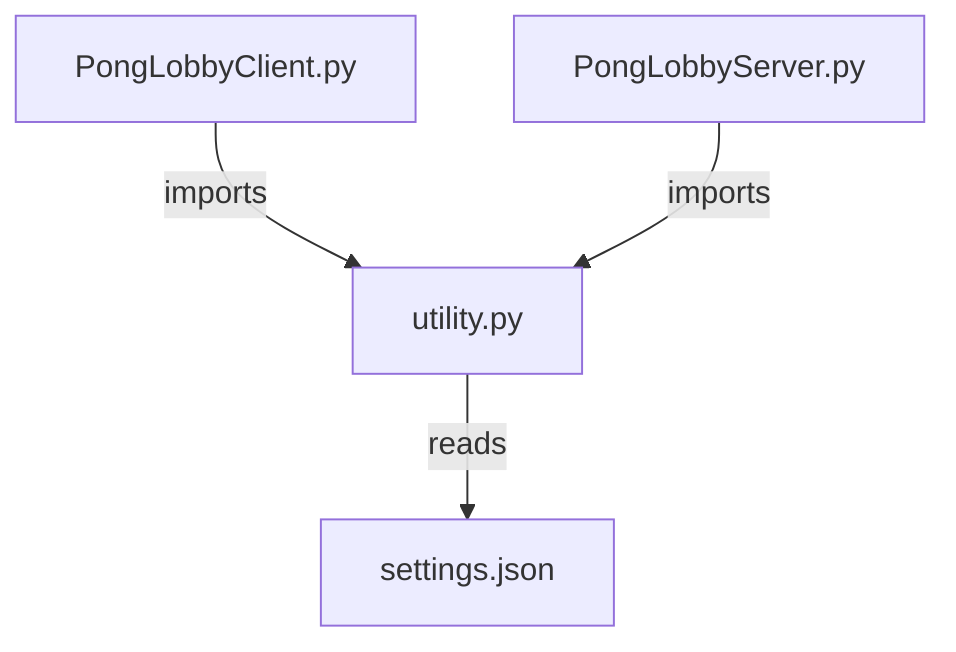
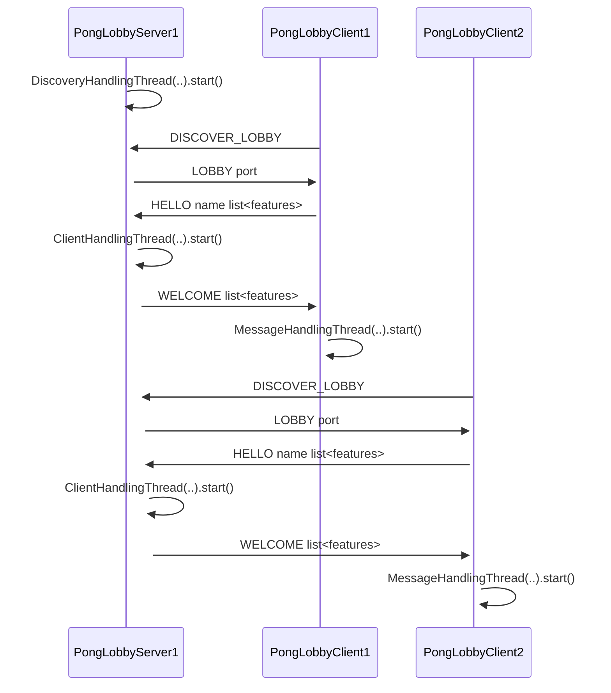
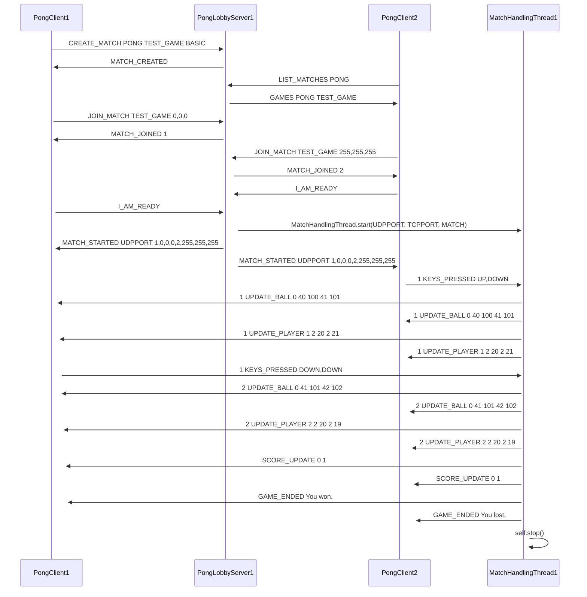

## Pong
### PongLobby (Client-Server-architecture)
#### Usage/Testing
1. Adjust settings (optional)  
2. Start the server `python PongLobbyServer.py`
3. Start the client `python PongLobbyClient.py`
    - Enter the username when prompted
    - Chat via command line; press Enter to send
#### Settings
##### Reusables
[utility.py](Settings/utility.py) contains the constant MESSAGE_ENDING which is specified as `\x00`.
Use it with `utility.MESSAGE_ENDING` after importing [utility.py](Settings/utility.py).
##### Structure
The settings are divided into 3 parts:
- common: settings relevant for server and client
- server: settings relevant only for server
- client: settings relevant only for client
##### Retrieval
The programm uses a JSON file to store relevant information for the client and server. By using this, we can maintain a structured data handling as well as a comfortable way to change parameters in a comfortable fashion. This works as follows:

The used JSON format can be found in [settings.json](Settings/settings.json). To work with the settings [utility.py](Settings/utility.py) is used.

##### Adding parameters
Please use and extend the pattern in [settings.json](Settings/settings.json), but do not change current structures without consent.

#### Current interaction
##### Discovery & Handshake
Currently the system uses multithreading to parallelize its task execution. Due to a very wait heavy programm flow (socket communication), multithreading is currently preferred over multiprocessing.
The following drawing illustrates the interaction between server and clients:

The server runs a thread to handle incoming UDP messages to decouple from the TCP traffic. When the server receives a valid DISCOVERY message, it sends a LOBBY message back. When a client sent a valid HELLO message to the submitted TCP port, the server starts a new thread to handle the client. Along the lines of the server, the client starts a thread handling incoming messages from the server, if the server completes the handshake successfully.

##### Chat
Currently the chat is supporting only messages to all users via command line. Own messages will not be displayed again at the own console.

Currently supported commands:
- `/list_games`
- `/create_match GAME GAME_NAME FEATURE1,FEATURE2,FEATURE3,..`
- `/list_matches PONG`
- `/match_features GAME_NAME`
- `/join_match GAME_NAME COLOR`
- `/quit`

Feedback is given in the chat.

### PongGame

#### Concept idea

This is a concept on how to solve the cooperation between lobby and game logic. A separate thread per match could be used to increase performance and enable distinct responsibilities. Additionally a MATCH class is required holding relevant information about a match (e.g. player sockets, colors, names, features) and functionality to manipulate the match.

## Best Practice
- Add #TODO's in your code to mark that functionality is missing
- Push often - preferably after a certain functionality is working (e.g. 2 interacting messages from client and server) - such that small mistakes can be easily reverted, meaning not the whole code is broken, but just a small part.
- Ask if you don't know! Everybody's glad to help!